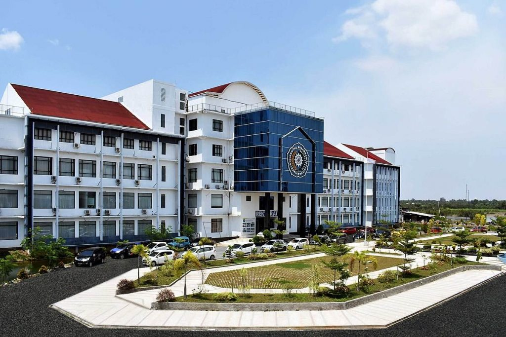

  <h1><b>CP1 - Image Gallery Project</b></h1>

  <h6><i>Image Gallery Project for Informatics Major, Universitas Muhammadiyah Banjarmasin</i></h6>
  

## 📌 Table of Contents
- [Introduction](#introduction)
- [Architecture](#architecture)
- [Database](#database)
- [API Documentation](#api-documentation)
- [Contributors](#contributors)

## 📖 Introduction
**CP1** is an image gallery project developed for the Informatics Major at **Universitas Muhammadiyah Banjarmasin**. 
This project consists of:
- **Backend:** A RESTful API built with Laravel (PHP)
- **Frontend:** A ReactJS-based web application for intuitive user interaction
- **Database:** MySQL for storing media files and related information

## 👥 Contributors
<table align="center">
  <tr>
    <td align="center" width="150">
      <a href="https://github.com/">
        
        
Zulfan

      </a>
    </td>
    <td align="center" width="150">
      <a href="https://github.com/Noval0857">
        
        
Noval

      </a>
    </td>
    <td align="center" width="150">
      <a href="https://github.com/Bayyeee">
        
        
Ubai

      </a>
    </td>
    <td align="center" width="150">
      <a href="https://github.com/caynine9">
        
        
Towi

      </a>
    </td>
  </tr>
</table>